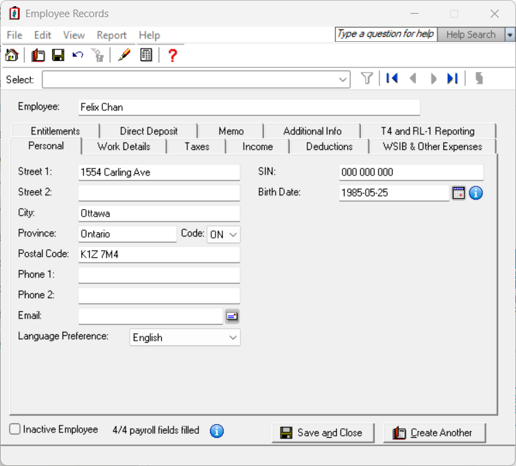

##########################
🍁 OBNOARDING EMPLOYEE 🍁
##########################

In the context of Canadian payroll administration, onboarding an employee refers to the formal process of integrating a new hire into 
both the organizational and payroll systems. It ensures that the employee is properly registered, legally compliant, and ready to be paid 
accurately and on time.

Key Steps on Onboarding an Employee:

*  Collect Required Personal Information: Includes full legal name, address, date of birth, and Social Insurance Number (SIN). The SIN is critical for tax reporting to the CRA (Canada Revenue Agency).

* Obtain Federal & Provincial Tax Forms: New employees must complete Form TD1 (Federal and possibly a Provincial version) to declare tax credits and determine income tax withholdings.

* Set Up Banking Info for Direct Deposit: Employees usually provide a void cheque or bank form to set up electronic payments.

* Register the Employee in the Payroll System: Involves entering all personal and job-related data, assigning a payroll ID, and verifying employment status (e.g. full-time, part-time, contract).

* Enroll in Benefits or Pension Programs: If applicable, the employee may be signed up for group insurance, retirement savings plans (like RRSP or pension plans), and other benefits. These deductions must be accurately reflected in payroll.

* Assign Statutory Deductions that Employers must withhold and remit

   - CPP (Canada Pension Plan)

   - EI (Employment Insurance)

   - Income Tax (based on TD1 form)

* Confirm Employment Agreement & Start Date

🍁 Compliance & Record Keeping

* Employers in Canada are responsible for keeping accurate records of employee data, pay stubs, deductions, and remittances for at least 6 years.

* If audited by CRA, these documents must be readily available.

* Employers must also provide T4 slips by end of February each year to summarize annual earnings and deductions for tax filing. 

Employment Standards Requirements
=================================

Each province/territory, as well as the federal government, sets minimum employment standards, including:

- Minimum wage
- Minimum age (may also be governed by other legislation)
- Required pay statement information:
  - Employee name
  - Pay period date
  - Rates of pay and hours worked
  - Gross earnings
  - Itemized deductions
  - Net pay

Internal Forms
==============

Typical commencement package forms include:

- Authorization for hiring
- Direct deposit agreement
- Union membership application
- Benefits enrollment (e.g., health/dental, pension)
- Confidentiality agreement

Authorization for Hiring
------------------------

This internal document includes:

- New employee's basic info
- Start date, department, salary
- Probation details
- Hiring authority’s signature

**Important:** Employer must obtain a valid SIN. A SIN starting with 9 must have a valid expiry date and associated work permit.

Union Membership
----------------

For unionized workplaces:

- Union dues are deducted
- Employees sign authorization for deduction
- Exemptions may apply, but dues equivalent still required

Benefit Enrollment Forms
------------------------

Forms cover group insurance and pension plans:

- Employee indicates coverage type
- Signatures authorize payroll deductions

Confidentiality Agreement
-------------------------

A legally binding agreement protecting sensitive company info:

- Defines proprietary data
- Outlines responsibilities, penalties, and timeframe

Required Federal and Provincial/Territorial Forms
=================================================

**Purpose:** Determine correct income tax withholdings.

Forms:

- TD1 (Federal)
- TD1 (Provincial/Territorial)
- TP-1015.3-V (Québec employees)

**Provincial/territorial withholding** is based on *province of employment*, but tax liability is based on *province of residence*.

**Adjustments:**

- Request extra withholding via TD1 or TP-1015.3-V
- Request reduction using CRA Form T1213 or RQ Form TP-1016-V

Essential Info on All Forms:

- Employee name
- Date of birth
- Social Insurance Number

Tax Credits (TD1)
-----------------

1. Basic personal amount
2. Canada caregiver (infirm children)
3. Age amount
4. Pension income
5. Tuition
6. Disability
7. Spouse/common-law partner amount
8. Eligible dependant
9. Caregiver for infirm spouse or dependant
10. Caregiver for dependant age 18+
11. Transfers from spouse
12. Transfers from dependant
13. Total

Additional Instructions:

- Fill out TD1 only if claiming more than basic credit
- Québec employees must always complete TP-1015.3-V

Tax Credits (TP-1015.3-V – Québec)
----------------------------------

- Basic amount
- Transfer from spouse
- Amount for dependants
- Impairment in mental/physical function
- Age amount, retirement income, living alone
- Career extension

Deductions:

- Remote area housing
- Deductible support payments

Entering Employee Information into Sage50
=========================================

To enter a new employee into the Sage 50 Payroll module (Canada edition), start by navigating to the Employees & Payroll section in the 
Home window. Right-click the Employees icon and choose "Add Employee" to begin creating employee's record. Input the employee's full legal 
name. Then, proceed to fill in the personal and payroll details across several tabs: the Personal tab for birth date and contact info, the Taxes tab to select the appropriate provincial 
tax table, the Income tab to configure their pay frequency, and the Deductions tab to define benefit or pension deductions. You'll also 
want to enter their bank details for direct deposit. For compliance, be sure to complete and store signed TD1 forms (Federal and Provincial) 
separately, as Sage50 does not automatically generate these. You'll also need to set up EI, CPP, and Income Tax deductions and link them to remittance vendors in the system. Once all 
information is reviewed for accuracy, save and close the record to finalize setup. If you prefer a guided approach, Sage50 also offers 
an Employee Wizard to walk you through these steps.

.. important::

  To maintain accuracy and compliance in Sage 50 Payroll, carefully verify that all employee information entered into the system,
  including full legal name, Social Insurance Number (SIN), residential address, and compensation details, matches the data provided on 
  official documentation such as the signed employment contract and government-issued identification (e.g. driver's licence, Employment Contract). 
  Double-checking these entries helps prevent administrative errors and ensures that payroll records remain consistent with legal and 
  regulatory standards.

Review Questions
----------------

#. Why is it important to enter "Date Hired" value?

Content Review Highlights
=========================

- Consent is required for personal info collection
- TD1 and TP-1015.3-V are used to calculate source deductions
- Claim amounts may differ between federal and provincial forms
- Employers must keep the forms on file (do not send to CRA/RQ)

Review Questions (Sample)
=========================

1. What does an offer letter signature signify?
2. What documents are included in a commencement package?
3. Name three common internal forms
4. What must payroll verify on a hiring form?
5. What must be checked for SINs starting with “9”?
6. True/False: Union dues can be deducted without consent.
7. What authorizes benefit premium deductions?

Example Evaluations
===================

**Gloria Meyer (Alberta):**
- Claimed: Basic, eligible dependant, transferred tuition
- Appears accurate

**Luc Laframboise (Québec):**
- Claimed: Basic, spouse, dependant in school, tuition transfer
- Appropriate provincial and federal claims made

**Ingrid Johansson (Alberta, Single Parent):**
- Claimed credits for two children
- **Overclaimed** dependant credit – only one is eligible
- Needs correction on federal and AB TD1 forms

.. admonition:: ONBOARDING EMPLOYEE EXERCISE

   Using MS Forms, create a questionaire for gathering all required information for onboarding a new employee at Quebec-based company for the payroll purposes.

